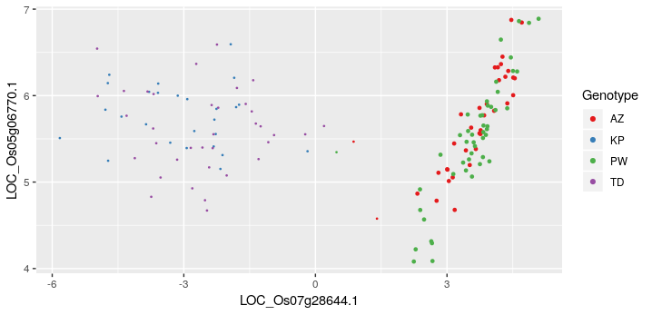

About KINC
==========

.. figure:: images/kinc.png
  :alt: KINC Logo

.. image:: https://zenodo.org/badge/71836133.svg
  :target: https://zenodo.org/badge/latestdoi/71836133


First, What is a Gene Co-expression Network (GCN)?
---------------------------------------------------
A Gene Co-expression Network `GCNs <https://en.wikipedia.org/wiki/Gene_co-expression_network>`_ is a **top-down** Systems Biology model of potential gene product interactions. The GCN is modeled as a graph consisting of nodes (i.e. vertices) and connections between them called edges.  We refer to these graphs as **networks**  in an applied setting such as when exploring gene expression. In a network, when an edge exists between two nodes it carries information. In the case of GCNs, where nodes are genes, the edges indicate correlation of expression.  It has been shown that correlation of expression does imply that two genes may be co-functional. This is known as **guilt-by-association**. Therefore, when groups of highly connected (i.e. highly correlated) genes appear in the GCN and tend to be less connected to other genes in the network (i.e. they form a **module** or cluster), **new hypotheses** can be formed suggesting that those highly connected genes, especially genes of unknown function, are co-functional.

How are Traditional GCNs Constructed?
-------------------------------------
GCNs, first referred to as relevance networks, have been constructed for approximately two decades.  They use the same gene expression data used by Differential Gene Expression (DGE) analysis. However, unlike DGE analysis which only provides a list of candidate differentially expressed genes, GCNs provide potential **context** or "neighborhood" in which those genes may be interacting. However, GCNs typically require more samples than a DGE experiment.

Construction of GCNs traditionally consist of these steps:

 * Preparation of input data.
 * **Pairwise correlation** of all genes with every other gene.
 *  **Thresholding** of non-signicant correlation values.
 *  **Module discovery**.

Each of these steps is described in the following sections.

Input data
``````````
To construct a GCN, the gene expression data is often organized into a Gene Expression Matrix (GEM). A GEM is a tab delimited file, contain an **n** x **m** data matrix where **n** is the number of genes and **m** is the number of measurements (or samples). The GEM is typically normalized and log2 transformed gene expression data from either RNA-Seq or microarray data. The tool `GEMmaker <https://github.com/SystemsGenetics/GEMmaker>`_ (a sister tool of KINC) can help create GEMs from RNA-Seq data using tools such as `Hisat2 <https://ccb.jhu.edu/software/hisat2/index.shtml>`_, `Kallisto <https://pachterlab.github.io/kallisto/>`_ or `Salmon <https://combine-lab.github.io/salmon/>`_.

Step 1: Pairwise Correlation
````````````````````````````
For traditional network construction, each gene in the GEM undergoes correlation analysis with every other gene.  This step can use any correlation step. The most popular have been Pearson, Spearman and Kendall Tau.  Others have substituted a correlation test for the Information Theory technique of Mutual Information (MI).  For any of these, this requires **n** ( **n** - 1 ) / 2 correlation calculation, where **n** is the umber of genes.  The end-result is an **n** x **n** similarity matrix containing the correlation values of each gene with every other gene.  This matrix can become quite large depending on the number of genes.

Step 2:  Thresholding
`````````````````````
The next step in GCN construction is thresholding. At this step, a method is applied to determine a correlation value below which all pairwise comparisons should be ignored. Those above the threshold are kept.  There have been a variety of approaches used for thresholding including ad-hoc methods, Random Matrix Theory (RMT), and soft-thresholding, to name a few.  Ad-hoc methods apply a reasonable rule such as keeping the top 1000 co-expressed genes. Simply, RMT involves principles of random matrix theory and applies those to the similarity matrix to explore at which correlation value the matrix begins to show signs of appearing more random.  And soft-thresholding was made popular by the `WGCNA <https://horvath.genetics.ucla.edu/html/CoexpressionNetwork/Rpackages/WGCNA/>`_ tool, published in 2008. With soft-thresholding there is no threshold applied but rather all data can participate, in a weighted manner, to module discovery.

Step 3:  Module discovery
`````````````````````````
After all non-significant pairwise correlation values have been removed, or in the case of soft-thresholding, weighted accordingly, modules can be identified.  Modules are groups of genes that are very highly connected with one-another and less connected with the remainder of the network.  Modules in networks tend to participate in the same role.  For genes, it implies co-functionality. There are many methods for module discovery. These include clustering by nodes such as with `MCL <https://micans.org/mcl/>`_ (Markov Clustering) and WGCNA; and clustering by edges such as with  `Linked Communities <https://www.rdocumentation.org/packages/linkcomm/versions/1.0-11>`_. WGNCA provides module discovery in combination with the soft-thresholding approach.

Problems with GCNs
------------------

Inappropriate Use of Correlation
````````````````````````````````
Despite their increasing use and successes, GCNs constructed in the traditional approach suffer from a variety of problems that if corrected can improve the discoverability that GCNs can afford.  First, blanket application of a single correlation method for all gene-expression relationships is inappropriate. Pearson correlation requires that a variety of assumptions are met, including equal variance (homoscedastic), no outliers, and linearity.  Spearman is similar except it is less susceptible to outliers and allows for non-linear relationships as long as they are monotonically increasing. Mutual Information approaches have been show to not perform any better than traditional correlation tests. In any case, when GEMs contain data from multiple experiments with varying conditions, the likelihood that the pairwise comparison of genes will follow the test assumptions decreases.  With the decreasing cost of DNA sequencing, and increasing size of experiments, GCNs will be less effective for larger experiment sizes.

Bias in Samples
```````````````
Second, traditional approaches to GCN construction are biased towards genes whose expression is correlated across almost all the samples. These tend to be basal processes such as transcription, translation, and ribosomal activity, or activities specific to the experimental condition that dominates the GEM. The result, therefore, are GCNs that consist primarily of basal processes and relationships specific to the dominant condition.  Genes that are pleiotropic (participate in multiple function) whose expression changes dependent on the condition will most likely be absent from the network.  When a large compendium (hundreds to thousands) of samples are used to create a **global** GCN, the result is biased towards these basal activities or over represented conditions in the data set.

High Thresholds
```````````````
In all traditional network construction approaches, the thresholding step often sets at a very high correlation value. For example, Random Matrix Theory (RMT) uses properties of the co-expression similarity matrix to threshold the network. When applied to similarity matricies generated using Pearson or Spearman correlation, the threshold is often at or above 0.85.  In many cases the threshold is above 0.9.  A large number of meaningful relationships are therefore excluded.  This implies a high level of noise (false positives and false negatives) that limit discovery of gene relationships to only the most highly correlated that transcend a very high level of noise.  GCNs whose threshold is cut too low, become unmanageable "hairballs" and when cut very highly, important potential interactions are lost.

Condition-Specific Relationships are Limited
````````````````````````````````````````````
Identification of relationships in the network that are specific to a condition such as developmental stage, tissue, genotype, experimental treatment, environment, etc., are limited due to the reasons mentioned above.  Researchers are forced to subdivide their samples into smaller groups that are limited to single conditions, create GCNs for each group and then compare the networks to identify condition-specific relationships or to view common relationships across all.  Yet, the noisy nature of GCNs can make network comparisons difficult and limit the discovery of condition-specific subgraphs within the GCN.

How Does KINC Address These Problems?
-------------------------------------
KINC, is an evolving tool that attempts to address the above mentioned challenges (and others as they are identified) with the objective of making GCNs more powerful in an age of increasingly large experiments consisting of multiple experimental conditions.  One important approach KINC uses to address these challenges, is `Gaussian Mixture Modules <https://en.wikipedia.org/wiki/Mixture_model>`_ (GMMs) to identify groups, or clusters, of similarity expressed genes in the pairwise comparison.  Clusters of samples have been observed in 2D plots of pairwise gene expression, and the hypothesis for the presence of these clusters is that they are the result of condition-specific gene expression. Consider the example in the following image:



Here, two genes from `Oryza sativa` (rice) show two "groupings" or clusters of samples.  The cluster to the right shows two genotypes (AZ and PW) that are clearly correlated. The cluster to the left is not.  GMMs can be used to identify these two groups and then apply a traditional correlation test to each cluster individually.

The use of GMMs addresses some of the challenges previously described.  First, the clusters follow a Gaussian distribution, thus, the assumptions of both Pearson and Spearman are met. This reduces the false edges or missing edges that occur when the correlation tests are applied incorrectly.  Second, over representation of a condition in the sample set does not bias against under-represented conditions so long as there are enough samples to identify a condition-specific clusters.

Third, condition-specific subgraphs can be identified by using knowledge of the input samples. KINC uses a hypergeometric test for categorical data and regression analysis for quantitative data  to compare the experimental conditions or phenotypes for each sample with the samples in a cluster.  The `p`-value and `r`-squared results from these tests are added to each edge in the network. Edges can then be filtered into smaller **condition-specific subgraphs**.


Computational Requirements
--------------------------
KINC can be run on a stand-alone Linux desktop or a High Performance Computing (HPC) cluster.  Traditional network construction (without GMMs) can easily be performed on a stand-alone machine.  However, depending on the number of genes and samples, use of GMMs may require access to Graphical Processing Units (GPUs), and as the size of the GEM grows larger, KINC may require multiple GPUs.  A table is provided in the :doc:`usage` section to help you decide what type of computational resource you may need.

KINC provides a graphical interface, named `qkinc` that can be used on a stand-alone machine for importing of the GEM file, thresholding, viewing result files, and network file export.  The graphical version can be used for similarity matrix calculation using GMMs only when the sample size is relatively small.

How was KINC created?
---------------------
KINC is built with `ACE <https://github.com/SystemsGenetics/ACE>`__, a framework which provides mechanisms for large-scale heterogeneous computing and data management. As such, KINC can be run in a variety of compute configurations, including single-CPU / single-GPU and multi-CPU / multi-GPU, and KINC uses its own binary file formats to represent the data objects that it consumes and produces. Each of these binary formats can be exported to a plain-text format for use in other applications.
