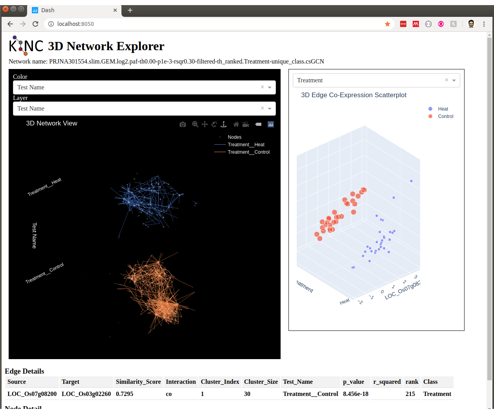

How to Create a Network
=======================
This section describes the two approaches for network construction as well as some general considerations.  For the examples shown below we will use an input GEM that is derived from the SRA Project with ID `PRJNA301554 <https://www.ncbi.nlm.nih.gov/bioproject/PRJNA301554/>`_. This dataset consists of 475 RNA-seq Illumina samples of rice grown under control, heat, drought, heat recovery and drought recover conditions.  It measures expression across four different genotypes of rice (from two subspecies) over a series of time points.  This dataset was selected because of its large size and multiple variables.

For the purposes of this tutorial, a sample GEM file, containing 60 samples from the PRJNA301554 experiment is used. This file is named ``PRJNA301554.slim.GEM.log2.txt`` and is found in the ``example`` directory of the KINC source code.

.. note::

    If you cannot find the ``example`` directory for KINC on your local machine you can download the files from the `KINC Github repository <https://github.com/SystemsGenetics/KINC/tree/master/example>`_.

The example file has been limited to 60 samples rather than 475 to ensure that KINC  executes quickly on a single workstation for the purposes of this tutorial.  These 60 samples consist of 30 randomly selected heat treatment samples and 30 randomly selected control samples. The tool `GSForge <https://systemsgenetics.github.io/GSForge/>`_ was used to find the genes that are most predictive of the experimental conditions. This resulted in a small set of 1,167 genes, and these are present in the example GEM file.  The gene expression levels (in FPKMs) for these 60 samples were quantified using `GEMmaker <https://gemmaker.readthedocs.io/en/latest/>`_.


Before Getting Started
----------------------

Traditional or GMM Approach?
````````````````````````````
Before proceedng you should identify if a traditional or GMM network is most appropriate. The following considerations can help with that decision.

Traditional Approach
::::::::::::::::::::

Advantages
  - Executes very fast.
  - Biological signal can be found at higher correlation values and when sample bias is skewed towards the question of interest

Disadvantages
  - Includes false edges due to improper application of correlation tests, and misses lower-correlated true edges due to excess noise.

GMM Approach
::::::::::::

Advantages
  - Limits correlation test bias by using GMMs to ensure test assumptions are met.
  - Can identify condition-specific pairwise expression.
  - Reduces the effect of sample bias when multiple conditions are present in the input GEM dataset.
  - Can execute very fast on a single machine for small GEMs.

Disadvantages
  - May require access to HPC with multiple GPUs for very large GEMs.
  - May not be useful if the sample metadata does not have qualitative (categorical) conditions.


.. _samples-needed-reference-label:

How Many Samples are Needed?
````````````````````````````

Networks can be created with very few samples if need be, but the power of the network will diminish greatly.  For traditional networks, you can manually perform a power analysis before network construction to identify what correlation value (i.e. effect size) you must not go below in thresholding in order to limit false edges (assuming correlation assumptions are met, which they are not in the traditional approach). The ``pwr.r.test`` function of the statistical programming language R can do this, and there are `online calculators <http://www.sample-size.net/correlation-sample-size/>`_ as well.

For example, the minimum number of samples required to meet the criteria of for a significance value of 0.001, a power value of 0.8 and a minimum correlation threshold of 0.5 is 60 samples. If we raise the minimum threshold to 0.7 we need at least 21 samples.  Only 11 samples are needed for a threshold limit of 0.9.  Thus, if we only had 11 samples we should not allow a correlation threshold below 0.9.

If you are using the GMM approach and you wish to find condition-specific subgraphs for a qualitative condition, such as for genes underlying response to a treatment (e.g.heat, drought, control, etc.) you must ensure that you have sufficient samples for each category.  Suppose you only had 10 samples per treatment, you would expect to find clusters of approximately size 10 for each treatment, and this would require a minimum correlation threshold of 0.9. You can remove edges whose correlation dips below the limit using the ``corrpower`` function. You can set the minimum cluster size when executing the ``similarity`` function.

.. note::

  The number of samples will dictate the quantity and size of the final network.  With few samples there is little chance of finding weakly correlated, but perhaps meaningful edges.

Do Replicates Matter?
`````````````````````
Unlike with DGE analysis, where multiple replicates are necessary to establish a statistical difference between two conditions, for GCNs a relationship between genes can be established using all data for that gene.  Therefore, It is not clear what contribution replicates make in the network.  Technical replicates are probably not useful.  Biological replicates may be useful but the benefit or bias from using replicates is not yet known.

Which Correlation Method to Choose?
```````````````````````````````````
KINC currently provides two correlation methods:  Pearson and Spearman.  Pearson is meant for linear relationships with no outliers that have equal variance.  Spearman is less affected by outliers and non-linearity so long as the relationship is monotonically increasing.  It is therefore recommended to use Spearman as not all relationships are linear.  However, Spearman correlation is less effective with small samples.  Empirically, Spearman tends to suffer when sample sizes dip below 20 to 30.  If you wish to identify condition-specific edges where each category (e.g. heat, drought, control) has fewer than 20 to 30 samples you should consider using Pearson.

Traditional Approach
--------------------
You can construct a traditional network on a stand-alone workstation using either ``kinc`` or ``qkinc``.  Using the 60-sample example rice dataset described above, the following steps show how to create a traditional network using the command-line. The arguments shown in the command-line examples below correspond directly to fields in the KINC GUI.


Step 1: Import the GEM
``````````````````````
The first step is to import the GEM into a binary format suitable for KINC. The ``import-emx`` function of KINC does this:

.. code:: bash

    kinc run import-emx \
       --input "PRJNA301554.slim.GEM.log2.txt" \
       --output "PRJNA301554.slim.GEM.log2.emx" \
       --nan "NA" \
       --samples 0

In the example code above the GEM file is provided to the ``--input`` argument and the name of an output EMX file is provided using the ``--output`` argument.  In the example above, the ``--nan`` argument indicates that the file uses ``"NA"`` to represent missing values. This value should be set to whatever indicates missing values. This could be ``"0.0"``, ``"-Inf"``, etc. and the GEM file has a header describing each column so the number of samples provided to the ``--samples`` argument is set to 0. If the file did not have a header the number of samples would need to be provided.

Step 2: Perform Correlation Analysis
````````````````````````````````````
Construction of a similarity matrix (or correlation matrix) is the second step. Here KINC performs pairwise comparison of every gene with every other gene using either Spearman or Pearson correlation.  The ``similarity`` function of KINC does this:

.. code:: bash

    kinc run similarity \
      --input "PRJNA301554.slim.GEM.log2.emx" \
      --ccm "PRJNA301554.slim.GEM.log2.traditional.ccm" \
      --cmx "PRJNA301554.slim.GEM.log2.traditional.cmx" \
      --clusmethod "none" \
      --corrmethod "spearman" \
      --minsamp 30 \
      --minexpr -inf \
      --mincorr 0.5 \
      --maxcorr 1

Here the EMX file created in the first step is provided using the ``--emx`` argument and the names of two output files are provided using the ``--cmx`` and ``--ccm`` arguments. These are the correlation matrix and clustering matrix  respectively.  Because we are using the traditional approach, the ``--clusmethod`` argument is set to ``"none"``.  The correlation method is set to use Spearman, and the minimum number of samples required to perform correlation is set to 30 using the ``--minsamp`` argument. Any gene pairs where one gene has fewer that ``--minsamp`` samples will be excluded.  This will exclude genes that have missing values in samples that causes the number of samples to dip below this level.  The ``--minsamp`` argument should be set equal to or lower than the number of samples present in the origin GEM input file and higher than an expected level of missigness (e.g. 10% missing values allowed).  The ``--minexp`` argument isset to negative infinity (``-inf``) to indicate there is no limit on the minimum expression value.  If we wanted to exclude samples whose log2 expression values dipped below 0.2, for instance, we could do so with this argument.  To keep the output files relatively small, we will exclude all correlation values below 0.5 using the ``--mincorr`` argument.  Sometimes errors occur in data collection or quantification yielding high numbers of perfectly correlated genes!  We can limit that by excluding perfectly correlated genes by lowering the ``--maxcorr`` argument. In practice we leave this as 1 for the first time we create the network, if we fail to find a proper threshold in a later step then one cause may be large numbers of perfectly correlated genes.

Step 3: Thresholding
````````````````````
There are four ways KINC can determine a threshold for a network: power-law, Random Matrix Theory (RMT), condition-specific and `ad hoc`.  RMT is the recommended approach for traditional networks.

.. _rmt-reference-label:

Method 1: Using RMT to Threshold
::::::::::::::::::::::::::::::::

The following command-line provides an example for RMT thresholding of the example 475-rice sample data:

.. note::

  RMT works best for traditional networks.

.. code:: bash

    kinc run rmt \
      --input "PRJNA301554.slim.GEM.log2.traditional.cmx" \
      --log "PRJNA301554.slim.GEM.log2.traditional.rmt.log" \
      --tstart "0.95" \
      --tstep "0.001" \
      --tstop "0.5" \
      --threads 1 \
      --epsilon 1e-6 \
      --mineigens 50 \
      --spline true \
      --minpace 10 \
      --maxpace 40 \
      --bins 60

The above command provides the correlation matrix (CMX) using the ``--input`` arugment, and the name of a log file, using the ``--log`` argument  where the results of chi-square testing is stored.  The RMT method will successively walk through all correlation values, in decreasing order from ``--tstart`` to ``--tstop``, using a step of ``--tstep``, and builds a new similarity matrix to test if the Nearest Neighbor Spacing Distribution (NNSD) of the Eigenvalues of that matrix appears Poisson.  A spline curve is fit to the NNSD if the ``--spline`` argument is ``TRUE`` (recommended) and random points along the line are selected to determine if the distribution appears Poisson.  This random selection will occur repeatedly by selecting a random set of ``--minpace`` numbers and increasing that on successive iterations to ``--maxpace``.  A Chi-square test is performed for each of these random selections and the result is averaged for each correlation value.  The ``--bins`` is the number of bins in the NNSD histogram and `1 - bins` indicates how many degrees of freedom the Chi-square test will have. In practice, a Chi-square value of 100 indicates that the correlation value begins to not look Poisson. The RMT approach will continue after seeing a Chi-square value of 100 until it sees one at the 200 at which point it stops.  It seeks past 100 to ensure it does not get trapped in a local minimum.

.. note::

  It is best to leave all options as default unless you know how to tweak the RMT process.

Once completed, you can determine the best threshold for the network by opening the logfile specified by the ``--log`` argument, and looking at the end of the file.  The threshold is listed on the last line of the file and should be used for extracing the network in step 4.

If the input GEM is especially noisy, the RMT method will fail to find a threshold. As it continues to search through decreasing correlation values, the time required to generate the eigenvalues dramatically increases and it may appear that RMT never completes.  To determine if this is the case, examine the log file. If you see the average correlation beyond 200 then this has occurred.  See the :doc:`troubleshooting` section to explore alternative methods.


Method 2: Using the Power-law Threshold
:::::::::::::::::::::::::::::::::::::::
The Power-law function tests to see if the network, at successively decreasing correlation values follows a power-law which is a property of scale-free network.  The power-law threshold can be used as an alternative to RMT when it fails to find a solution. The following example uses the power-law threshold for the example 475-rice sample data:

.. code:: bash

  kinc run powerlaw \
    --input "PRJNA301554.slim.GEM.log2.traditional.cmx" \
    --log "PRJNA301554.slim.GEM.log2.traditional.powerlaw.log" \
    --tstart 0.99 \
    --tstep 0.01 \
    --tstop 0.5

Here the correlation matrix (CMX) file is provided as well as a log file where details about the analysis are stored. The ``--tstart`` argument sets the starting correlation value and power-law calculations continue until the ``--tstop`` value is reached.

If function fails to find an threshold then see the :doc:`troubleshooting` section to explore alternative methods.

.. warning::

  While the power-law threshold is useful to help identify scale-free behavior, it does not that the network is modular and hierarchical.

Method 3: Applying a Condition-Specific Filter
::::::::::::::::::::::::::::::::::::::::::::::
The condition-specific thresholding approach uses an annotation matrix that contains metadata about the samples such as the experimental conditions or phenotypes.  The approach to perform condition-specific thresholding is the same as for the GMM approach. Please refer to the :ref:`csfilter-reference-label` section for details about using condition-specific filters for either traditional or GMM networks.

.. warning::

  Condition-specific thresholding only works with traditional networks when the metadata in the annotation matrix is quantitative.

Method 2: Using an `Ad Hoc` Approach
::::::::::::::::::::::::::::::::::::
An `ad hoc` threshold does not use an anlytical approach to determine a threshold. Instead, the researcher selects a reasonable threshold. For example, this could be the minimum correlation that selects the top 1000 relationships, or yields a network that has desired size or communities.  These types of thresholding approaches have been used for peer-reviewed published networks but users should be cautious when using this approach.

Step 4: Extracting the Network File
```````````````````````````````````
How ever you have chosen to threshold the network, either with RMT or Power-law, or some `ad-hoc` approach, you will have a minimum correlation value.  This value can be used to extract any pairwise comparison between genes in the correlation matrix file (CMX) that are above the absolute value of the minimum correlation. These become edges in the final network.  The ``extract`` function of KINC will do this:

.. code:: bash

    kinc run extract \
      --emx "PRJNA301554.slim.GEM.log2.emx" \
      --ccm "PRJNA301554.slim.GEM.log2.traditional.ccm" \
      --cmx "PRJNA301554.slim.GEM.log2.traditional.cmx" \
      --format "tidy" \
      --output "PRJNA301554.slim.GEM.log2.traditional.paf-th0.826002-gcn.txt" \
      --mincorr  0.826002 \
      --maxcorr 1

As in previous steps, the ``--emx``, ``--cmx`` and ``--ccm`` arguments provide the exrpession matrix, correlation and clustering matricies. The threshold is provided to the ``--mincorr`` argument.  Additinally, if you would like to exclude high correlations (such as perfect correlations), you can do so with the ``--maxcorr`` argument. You should only need to change the ``--maxcorr`` argument if it was determined that there is error in the data resulting in an inordinate number of high correlations.  The ``--format`` argument can be ``text``, ``minimal`` or ``graphml``. The ``text`` format currently contains the most data. It is easily imported into Cytoscape or R for other analyses and visualizations. The ``minimal`` format simply contains the list of edges with only the two genes and the correlation value. The ``graphml`` format provides the same information as the ``minimal`` format but using the `GraphML <http://graphml.graphdrawing.org/>`_ file format.

See the :ref:`plain-text-reference-label`  section for specific details about these files.

GMM approach
------------
Here we perform network construction using the Gaussian Mixture Model (GMM) appraoch.  With this approach, each pair-wise comparision of every two genes undergoes a cluster identification analysis using GMMs. This approach can identify clusters, or groups, of samples that have similar but distinct ranges of expression. The underlying hypothesis is that when clusters appear, they represent condition-specific gene expression.  Clusters that are identified in gene pairs are correlated independently and each cluster has the potential to become a separate edge in the network.  Because we know the samples that are present in each cluster, KINC uses a hypergeometric test to compare categorical data about samples with cluster membership, and regression analysis to compare qualitative and ordinal data. Condition-specific thresholding can be performed on the `p`-values and `r`-squared values of those test to generate condition-specific subgraphs.

.. note::

  The GMMs approach requires a tab-delimited annotation matrix file (AMX) that contains metadata about samples where columns are feature that contain experimental condition information or phenotype data.

Step 1: Import the GEM
``````````````````````
.. code:: bash

    kinc run import-emx \
       --input "PRJNA301554.slim.GEM.log2.txt" \
       --output "PRJNA301554.slim.GEM.log2.emx" \
       --nan "NA" \
       --samples 0

In the code above the GEM file is provided to the ``import-emx`` function and the name of an output EMX file is provided.  The file uses "NA" to indicate missing values and  it has a header so the number of samples is set to .

Step 2: Perform GMM + Correlation Analysis
``````````````````````````````````````````
The second step is to use GMM to identify clusters and then perform correlation analysis on each cluster.

.. code:: bash

    kinc run similarity \
       --input "PRJNA301554.slim.GEM.log2.emx" \
       --ccm "PRJNA301554.slim.GEM.log2.ccm" \
       --cmx "PRJNA301554.slim.GEM.log2.cmx" \
       --clusmethod "gmm" \
       --corrmethod "spearman" \
       --minexpr -inf \
       --minsamp 25 \
       --minclus 1 \
       --maxclus 5 \
       --crit "ICL" \
       --preout TRUE \
       --postout TRUE \
       --mincorr 0 \
       --maxcorr 1

Here the EMX file created in the first step is provided, and the names of the two output (CCM and CMX) files are provided.  Because we are using the GMM approach, the ``--clusmethod`` argument is set to ``"gmm"``.  The correlation method is set to use Spearman.  Other argument specific to the GMM appraoch include ``--crit``, ``--maxclus``, ``-minclus``, ``--preout``, and ``--postout``. These have the following meaning:

-  ``--crit``: This is the criterion to select a clustering model. This should remain as ``ICL`` unless a higher number of modules per pair is desired and can be set to 'BIC'.
- ``--minclus``: The minimum number of clusters that can be found per gene pair.  Unless you are specifically looking for genes with multi-modal expression this should remain s 1.
- ``--maxclus``: The maximum number of clusters that can be found per gene pair.
- ``--preout``: Set to TRUE to turn on removal of outliers prior to GMM clustering. FALSE otherwise.
- ``--postout``:  Set to TRUE to remove outliers that may be present in GMM clusters. FALSE  otherwise.


The ``--minexp`` argument isset to negative infinity (``-inf``) to indicate there is no limit on the minimum expression value.  If we wanted to exclude samples whose log2 expression values dipped below 0.2, for instance, we could do so.  To keep the output files relatively small, we will exclude all correlation values below 0.5 using the ``--mincorr`` argument.

Sometimes errors occur in data collection or quantification yielding high numbers of perfectly correlated genes!  We can limit that by excluding perfectly correlated genes by lowering the ``--maxcorr`` argument. In practice we leave this as 1 for the first time we create the network.


Step 3: Filter Low-Powered Edges
````````````````````````````````
As discussed in the :ref:`samples-needed-reference-label` section above, the power of a correlation analysis is dependent on the number of samples in the test.  Unlike the traditional approach, where a power analysis can indicate the minimum correlation threshold below which you should not drop, a power-analysis for the GMM approach must be applied to each cluster separately.  The ``corrpower`` function does this and removes underpowered clusters from the matricies. For example:

.. code:: bash

    kinc run corrpower \
       --ccm-in "PRJNA301554.slim.GEM.log2.ccm" \
       --cmx-in "PRJNA301554.slim.GEM.log2.cmx" \
       --ccm-out "PRJNA301554.slim.GEM.log2.paf.ccm" \
       --cmx-out "PRJNA301554.slim.GEM.log2.paf.cmx" \
       --alpha 0.001 \
       --power 0.8

As shown above, the power and signficance criteria are set with the ``--power`` and ``--alpha`` arguments respectively.  An ``alpha`` setting of ``0.001`` indicates that we want to limit the Type I error (false positives) to a signicance level of 0.001.  The Power uses the formula 1-`Beta` where `Beta` is the probability of a Type II error (false negative) occuring.  A ``--power`` setting of 0.8 indicates that we are comfortable with a 20% false negative rate. There is no rule for how to set these.  Set them to the levels of noise you are comfortable with.

.. note::

  Remember, to find edges in the nework associated with categorical features, you must have enough samples with the given category in order to find a cluster an then to have sufficent power. The ``--minsamp `` argument in the ``similarity`` step sets the smallest allowable cluster size.

Step 4: Condition-Specific Filtering
````````````````````````````````````
Condition-specific filtering is performed using the ``cond-test`` function of KINC. It requires an annotation matrix containing metadata about the RNA-seq samples. It performs a hypergeometric test for categorical features and linear regression analysis for quantitative features that assigns *p*-values and R:sup:`2` values, as appropriate, to each edge in the network. The following shows an example:

.. code:: bash

    kinc run cond-test \
       --emx "PRJNA301554.slim.GEM.log2.emx" \
       --ccm "PRJNA301554.slim.GEM.log2.paf.ccm" \
       --cmx "PRJNA301554.slim.GEM.log2.paf.cmx" \
       --amx "PRJNA301554.slim.annotations.txt" \
       --output "PRJNA301554.slim.GEM.log2.paf.csm" \
       --feat-tests "Subspecies,Treatment,GTAbbr,Duration" \
       --feat-types "Duration:quantitative"

Here, the ``--emx``, ``--ccm``, and ``--cmx`` arguments provide the usual expression matrix, cluster matrix and correlation matrix respectively.  The ``--amx`` argument specifies the :ref:`amx-reference-label`.  The name of new condition-specific matrix, that will contain the results of the tests is set using the  ``--output`` argument.

Finally, it may not be desired to test all of the metadata features (i.e. columns) from the annotation matrix.  Using the ``feat-tests`` argument you can specify a comma-separated list (without spaces) of the names of the columns in the annotation matrix file that should be tested.  These can be either categorical, quantitative or ordinal.  KINC will do its best to determine the top of data in each column, but you can override the type using the ``--feat-types`` argument and specifying the type by separating with a colon.


Step 5: Extract Condition-Specific Subgraphs
````````````````````````````````````````````
When using the GMM approach, the goal is to identiy condition-specific subgraphs. These are subsets of a larger "unseen" network that are specific to a given condition.  As with the traditional approach, the ``extract`` function of KINC will do this:

.. code:: bash

    p="1e-3"
    r2="0.30"
    th="0.00"
    kinc run extract \
        --emx "PRJNA301554.slim.GEM.log2.emx" \
        --ccm "PRJNA301554.slim.GEM.log2.paf.ccm" \
        --cmx "PRJNA301554.slim.GEM.log2.paf.cmx" \
        --csm "PRJNA301554.slim.GEM.log2.paf.csm" \
        --format "tidy" \
        --output "PRJNA301554.slim.GEM.log2.paf-th${th}-p${p}-rsqr${r2}.txt" \
        --mincorr $th \
        --maxcorr 1 \
        --filter-pvalue $p \
        --filter-rsquare $r2

As in previous steps, the ``--emx``, ``--cmx``, ``--ccm`` and ``--csm`` arguments provide the expression matrix, correlation, clustering matrix and the new condition-specific matrix. A threshold is provided to the ``--mincorr`` argument typically as a lower-bound. No edges with absolute correlation values below this value will be extracted.   Additinally, if you would like to exclude high correlations (such as perfect correlations), you can do so with the ``--maxcorr`` argument. You should only need to change the ``--maxcorr`` argument if it was determined that there is error in the data resulting from an inordinate number of high correlations.  In the example above the ``--mincorr`` is set at 0.5. This is quite low by traditional standards but the following filtering and thresholding steps support exploration of edges at such a low correlation.

To limit the size of the condition-specific subgraphs you should then set the ``--filter-pvalue`` and ``--filter-rsquare`` values to lower-bounds for signficant p-values and meaningful r-square values from test.  The r-square values are only present for quantitative features where the regression test was performed.  The p-value in this case indicates how well the data follows a trend and the r-square indicates how much of the variation the trend line accounts for.  Ideally, low p-values and high r-squre are desired. However, there are no rules for the best setting, but choose settings that provide a signficance level you are comfortable with.

Finally, the ``--format`` argument can be ``tidy``, ``text``, ``minimal`` or ``graphml``. The ``tidy`` format is recommended for use by later steps. The the `GraphML <http://graphml.graphdrawing.org/>`_ version is larger in size and in an XML format compatible with other graph tools. The ``tidy``, ``test`` and ``graphml`` formats are easily imported into Cytoscape. The ``minimal`` format contains the list of edges with only the two genes and the correlation value. See the :ref:`plain-text-reference-label`  section for specific details about these files.

Complex Filtering
:::::::::::::::::

For either the ``--filter-pvalue`` or ``--filter-rsquare`` you can specify more complex filters in any of the following forms:

1.  ``[value]``
2.  ``[class],[value]``
3.  ``[class],["gt","lt"],[value]``
4.  ``[class],[label],[value]``
5.  ``[class],[label],["gt","lt"],[value]``

Where:

- ``[value]`` is a p-value or r-squared value on which edges should be filtered.
- ``[class]`` is the name of a condition (i.e. the column header label in the annotation matrix) where any tests performed by the ``cond-test`` function should be applied.
- ``["gt","lt"]`` is either the abbreviation "gt" or "lt" indicating if values "greater than" or "less than" that specified by ``[value]`` should be extracted.
- ``[label]`` is set to a category label within the condition class (for categorical data only) to further refine filtering of categorical test results.

If a ``[value]`` filter is provided (i.e. only a single numeric value), as in the example code above, then the filter applies to all tests that were performed. For example, a filter of ``1e-3`` indicates that any test performed in the ``cond-test`` step that has a value less than 1e-3 should be  extracted.

If a ``[class],[value]`` filter is provided then the filter applies to only tests for the given label, and all other tests are ignored.  For example. To find edges that are specific to any Subspecies with a p-value < 1-e3, the following filter could be supplied:  ``Subspecies,1e-3``. If "gt" or "lt" is missing it is implied as "lt" for p-value filters and "gt" for r-squared filters.

If a ``[class],["gt","lt"],[value]`` filter is provided then the filter is the same as the ``[class],[value]`` except that the selection of greater than or less than is excplicitly stated.

Finally, the filters, ``[class],[label],[value]`` and ``[class],[label],["gt","lt"],[value]``, are only applicable to tests were categorical data was used. The latter explicitly provides the "greater than" or "less than" specification. Here the filter specifically expects a given category.  For example. To find edges that are specific to only the Indica subspecies with a p-value < 1-e3, the following filter could be supplied:  ``Subspecies,Indica,lt,1e-3``. If "gt" or "lt" is missing it is implied as "lt" for p-value filters and "gt" for r-squared filters.

Filters can be combined by separating them with two colons: ``::``.  For example, to find edges that are specific to heat but not heat recovery the following would require a signficant p-value for Heat and a non-signficant p-value for heat recoery:  ``Treatment,Heat,1e-3::Treatment,Heat Recovery,gt,1-e3``

.. note::

  Filters limit the extracted edge list by finding edges that meet the criteria but do not exclude edges that may be signficant for other tests. For example, If the filter ``Treatment,Heat,1e-3`` is supplied it will find edges that meet that filter but does imply the other tests such as a signficant Supspecies is not also present.

Step 6: Remove Biased Edges
```````````````````````````
This step must be performed using the ``filter-condition-edges.R`` R script. It uses `KINC.R<https://github.com/SystemsGenetics/KINC.R>`_ package, an R companion library for KINC.  KINC is an actively developed software project and functions are often implemented in R before being moved to the faster C++ based KINC software.  *You must install KINC.R prior to using this script.*.  A false edge can be present under two known conditions:

1. **Lack of differentical cluster expressin (DCE)**. Lack of DCE occurs when GMMs detected a unique cluster in the co-expression between two genes, but the mean expression level of each cluster is not different between the two genes.  For the condition-specific edge to be true, it must have different expression within the cluster than without.  The script uses a Welch's Anova test to compare the mean expression of the in- and out-cluster samples for each gene.  This test allows for unequal variance.
2. **Unbalanced missing data**.  When one gene has more missing expression values than another it biases the co-expression relationship towards a condition if that gene's expression is condition-specific.  The missingness patterns of both genes must be similar.  A T-test is used to compare the difference in missingness between the two genes of an edge.

The following examle demonstrates how to remove biased edges:

.. code:: bash

    kinc-filter-bias.R \
        --net "PRJNA301554.slim.GEM.log2.paf-th0.00-p1e-3-rsqr0.30.txt" \
        --emx "PRJNA301554.slim.GEM.log2.txt" \
        --out_prefix "PRJNA301554.slim.GEM.log2.paf-th0.00-p1e-3-rsqr0.30"


Here the ``--net`` argument specifies the name of the network created using the ``extract`` function of KINC. It must be in tidy format. The ``--emx`` argument specifies the original GEM provided to the ``import-emx`` function, and the ``--out_prefix`` provides a name for the filtered output file.

By default the script will use a *p*-value threshold of 1e-3 for the Welch's Anova test and 0.1 for the t-test. Edges with a *p*-value less than 1e-3 will be kept for the Welch's test and a *p*-value greater than 0.1 (indicating a difference in missigness can't be detected) for the t-test. You can adjust these thresholds using the ``--wa_th`` and ``--mtt_th`` arguments respectively.  See the help text (by running the script with no arguments) for other options.

.. warning::

  If the condition-specific network, extracted from KINC is very large (i.e several Gigabytes in size) it may be slow to run this script. The script is multi-threaded and by default will use all but 2 of the available CPU cores to speed up processing.

Step 7: Generate Summary Plots
``````````````````````````````
After filtering of the network, it is useful to explore how the distribution of *p*-values and R:sup:`2` values differ between conditions and similarity scores.  This helps understand the level of condition-specific response in the network.  This can be performed using the ``make-summary-plots.R`` R script, which also uses KINC.R.  The following is an example of a plot generated by this script:


The following is an example to generate the summary plots:

.. code:: bash

    kinc-make-plots.R \
        --net "PRJNA301554.slim.GEM.log2.paf-th0.00-p1e-3-rsqr0.30-filtered.GCN.txt" \
        --out_prefix "PRJNA301554.slim.GEM.log2.paf-th0.00-p1e-3-rsqr0.30-filtered"

Here the ``--net`` argument specifies the name of the network. This should be the network created after Step 6:  filtering biased conditional edges.  The ``--out_prefix`` provides the file name prefix for the output images.

Step 8: Threshold the Network by Ranks
``````````````````````````````````````
In many cases the condition-specific networks can be very large. This is especially true if time-series data is present and if during the ``extract`` function of KINC a very low minimum similarity score threshold was used (e.g. 0.5).  It is not yet clear how many false or true edges remain in the network.  Therefore, it is beneficial to perform one last threshold to reduce the size of the network.   Here, the similarity score, *p*-value and R:sup:`2` values for each edge are ordered and ranked independently. Then a valuation of each edge, based on the weighted sum of all of the ranks is calculated. Finally the edges are given a final rank in order (smallest to largest) by their valuation.  You can then perform an *ad hoc* filtering by retaining only the top *n* edges.

To peform this ranking the Rscript ``rank-condition-threshold.R`` is used. It too uses KINC.R.  The following provides an example for filtering the entire network.

.. code:: bash

    kinc-filter-rank.R \
        --net "PRJNA301554.slim.GEM.log2.paf-th0.00-p1e-3-rsqr0.30-filtered.GCN.txt" \
        --out_prefix "PRJNA301554.slim.GEM.log2.paf-th0.00-p1e-3-rsqr0.30-filtered" \
        --top_n 26035

Here, we provide the network filtered by Step 6 for the ``--net`` argument and the ``-out_prefix`` is used to name the resulting output file.  The ``--top_n`` arguments allows us to use an `ad hoc` threshold to keep only the best ranked edges. This example network is small, so the ``--top_n`` argument is set to the total number of edges. By default, the ``--top_n`` argument is set to 10,000.  You can use this to filter the best edges when networks become extremely large.

To create individual files for each condition add the ``--save_condition_networks`` argument. The resulting file will include the top *n* edges per condition not just the top *n* for the entire network:

.. code:: bash

    kinc-filter-rank.R \
        --net "PRJNA301554.slim.GEM.log2.paf-th0.00-p1e-3-rsqr0.30-filtered.GCN.txt" \
        --out_prefix "PRJNA301554.slim.GEM.log2.paf-th0.00-p1e-3-rsqr0.30-filtered" \
        --save_condition_networks \
        --top_n 26035

If you are interested in exploring edges that are unique to a given category (e.g. heat or drought within a Treatment class) then you can provide the ``--unqique_filter`` argument with the value "label":

.. code:: bash

    kinc-filter-rank.R \
        --net "PRJNA301554.slim.GEM.log2.paf-th0.00-p1e-3-rsqr0.30-filtered.GCN.txt" \
        --out_prefix "PRJNA301554.slim.GEM.log2.paf-th0.00-p1e-3-rsqr0.30-filtered" \
        --save_condition_networks --unique_filter "label" \
        --top_n 26035


The result from the command-above is a set of files, one per condition class/label that contain only edges that are unique to the condition label (i.e. category) and is not signficant for any other condition.

Finally, you can export the top *n* for a given condition class (e.g. Treatment) by providing the value "class" to the ``--unique_filter`` argument.

.. code:: bash

    kinc-filter-rank.R \
        --net "PRJNA301554.slim.GEM.log2.paf-th0.00-p1e-3-rsqr0.30-filtered.GCN.txt" \
        --out_prefix "PRJNA301554.slim.GEM.log2.paf-th0.00-p1e-3-rsqr0.30-filtered" \
        --save_condition_networks --unique_filter "class" \
        --top_n 26035

The result from the command-above is a set of files, one per condition class where the top *n* edges per class are kept. An edge may be signficant for multiple labels within the class but not for any other class.

Step 9: Visualization
`````````````````````
You can visualize the network using 2D layout tools such as `Cytocape<https://cytoscape.org/>`_, which is a feature rich 2D viauliation software packge.  However, KINC includes a Python v3 Dash-based application that can be used for 3D visualization of the network.  You must have the following Python v3 libraries installed prior to using this viewer:

 - argparse
 - numpy
 - pandas
 - igraph
 - plotly
 - seaborn
 - fa2 (ForceAtlas2)
 - dash
 - progress.bar

The following is an example for launching the viewer for the network containing all condition-specific subgraphs:

.. code:: bash

    kinc-3d-viewer.py \
        --net "PRJNA301554.slim.GEM.log2.paf-th0.00-p1e-3-rsqr0.30-filtered-th_ranked.csGCN.txt" \
        --emx "PRJNA301554.slim.GEM.log2.txt" \
        --amx "PRJNA301554.slim.annotations.txt"

Alternatively, you can view the condition-specific networks for the duration-specific subgraph:

.. code:: bash

    kinc-3d-viewer.py \
    --net "PRJNA301554.slim.GEM.log2.paf-th0.00-p1e-3-rsqr0.30-filtered-th_ranked.Duration-unique_class.csGCN.txt" \
    --emx "PRJNA301554.slim.GEM.log2.txt" \
    --amx "PRJNA301554.slim.annotations.txt"

and for the treatment-specific subgraph:

.. code:: bash

    kinc-3d-viewer.py \
        --net "PRJNA301554.slim.GEM.log2.paf-th0.00-p1e-3-rsqr0.30-filtered-th_ranked.Treatment-unique_class.csGCN.txt" \
        --emx "PRJNA301554.slim.GEM.log2.txt" \
        --amx "PRJNA301554.slim.annotations.txt"

The first time the viewer is launched it will take a few moments to generate 2D and 3D layouts for the network.  This will result in a set of new layout files created in the same folder as the network. These will only generated once and will be re-used if the script is re-run.  After creation of the layouts, a URL will be provided on the screen which should then be opened in a web browser.  Output similar to the following should be seen in the terminal:

.. code::

    Reading network file...
    Reading GEM file...
    Reading experioment annotation file...
    Launching application...
     * Serving Flask app "kinc-3d-viewer" (lazy loading)
     * Environment: production
       WARNING: This is a development server. Do not use it in a production deployment.
       Use a production WSGI server instead.
     * Debug mode: off
     * Running on http://127.0.0.1:8050/ (Press CTRL+C to quit)


Finally, open the web browser to the specified URL to view the network.


