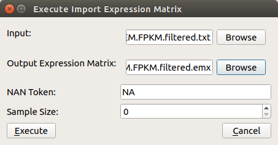
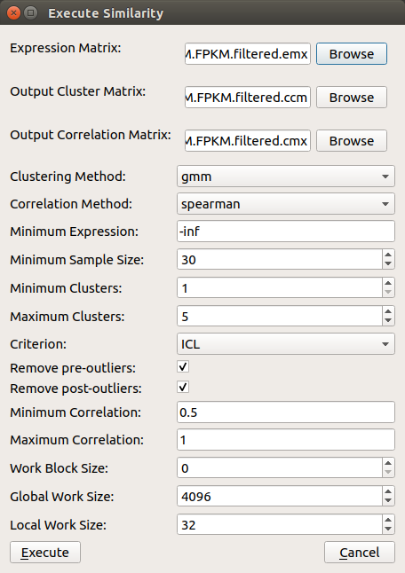
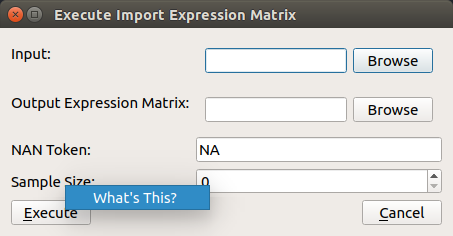
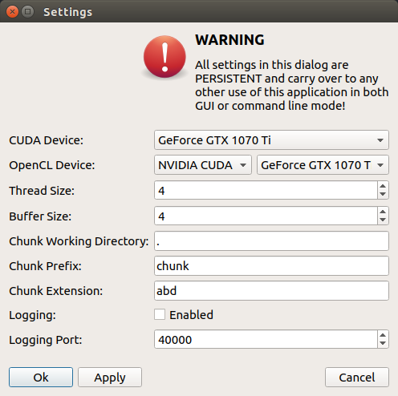
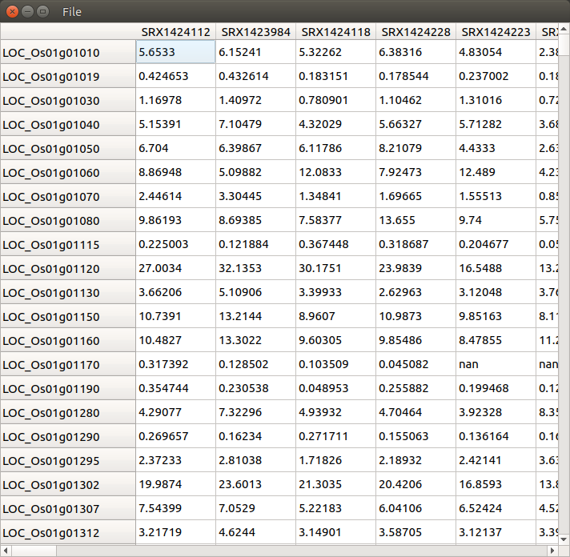
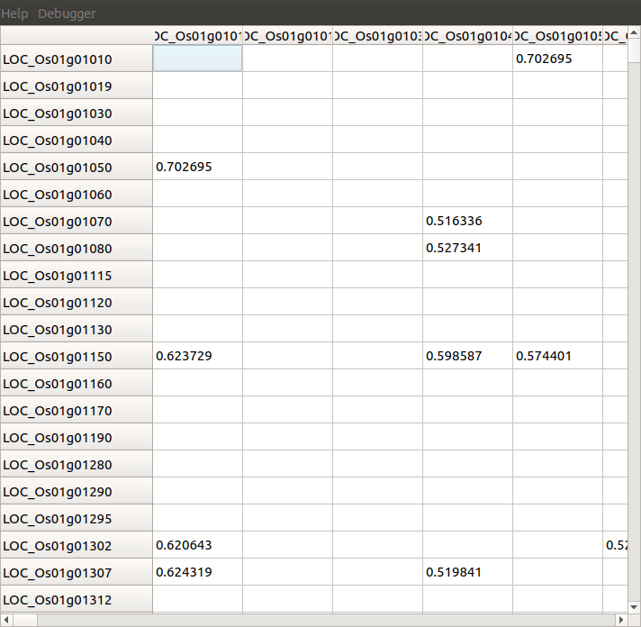
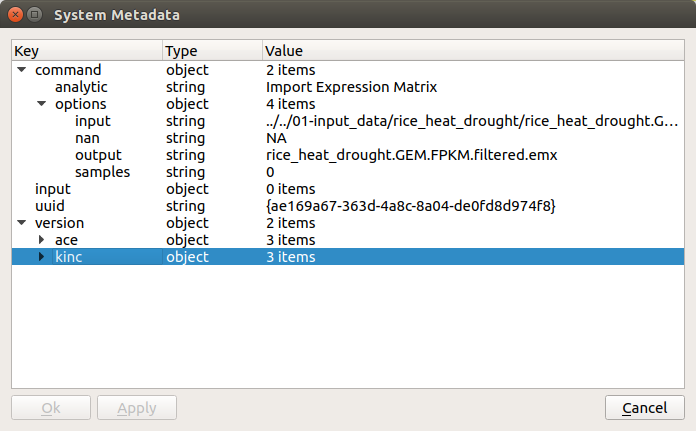
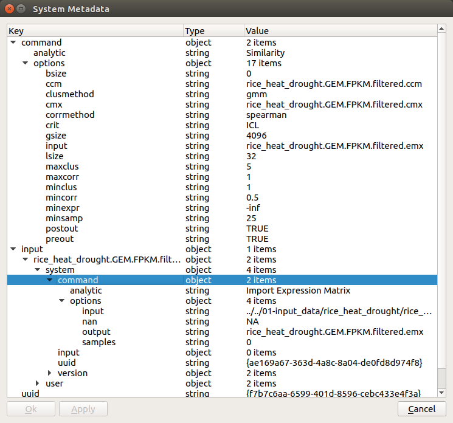
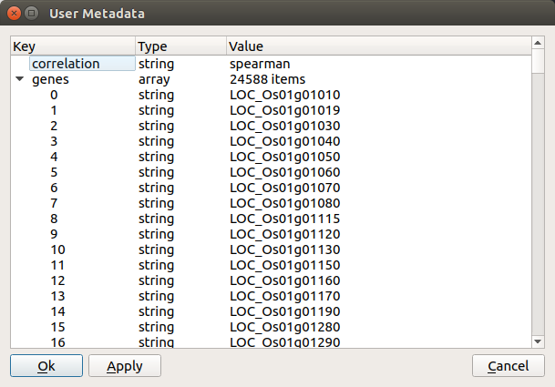

Usage
=====

What KINC program to use?
-------------------------
KINC is meant to be used either on a stand-alone workstation or on a heterogenous cluster of computers.  The graphical program, ``qkinc``, the command-line tool ``kinc`` and scripts are meant to be used in different circumstances. The following table indicates when one should be used over the other.

+-------------------------------------------+------------------------------+---------------------+
| Task                                      | Program or Script            | Resource            |
+===========================================+==============================+=====================+
| Viewing binary files created              | ``qkinc``                    | Stand-alone machine |
| by KINC (emx, cmx, ccm or csm files)      |                              |                     |
+-------------------------------------------+------------------------------+---------------------+
| Importing GEM                             | ``qkinc`` or ``kinc``        | Stand-alone or HPC  |
+-------------------------------------------+------------------------------+---------------------+
| Traditional network construction          | ``qkinc`` or ``kinc``        | Stand-alone or HPC  |
+-------------------------------------------+------------------------------+---------------------+
| GMM-based network construction for a      | ``qkinc`` or ``kinc``        | Stand-alone or HPC. |
| small GEM (<60 samples, <20K genes)       |                              | GPU recommended     |
+-------------------------------------------+------------------------------+---------------------+
| GMM-based network construction for a      | ``kinc``                     | HPC only.           |
| large GEM                                 |                              | GPU required.       |
+-------------------------------------------+------------------------------+---------------------+
| RMT, Power-law or condition p-value       | ``qkinc`` or ``kinc``        | Stand-alone or HPC  |
| thresholding                              |                              |                     |
+-------------------------------------------+------------------------------+---------------------+
| Network extraction                        | ``qkinc`` or ``kinc``        | Stand-alone or HPC  |
+-------------------------------------------+------------------------------+---------------------+
| Filter biased condition-specific          | ``filter-condition-edges.R`` | Stand-alone or HPC  |
| networks                                  |                              |                     |
+-------------------------------------------+------------------------------+---------------------+
| Rank-based thresholding of                | ``filter-condition-edges.R`` | Stand-alone or HPC  |
| condition-specific networks               |                              |                     |
+-------------------------------------------+------------------------------+---------------------+
| Generate summary plots                    | ``make-summary-plots.R``     | Stand-alone or HPC  |
+-------------------------------------------+------------------------------+---------------------+
| 3D Visualization                          | ``view3D-KINC-tidy.py``      | Stand-alone         |
+-------------------------------------------+------------------------------+---------------------+

Using the Command-Line
----------------------

Getting Started
```````````````
Using the ``kinc`` program will invoke the command-line interface.  Running ``kinc`` without any options will automatically provide default usage instructions for retrieving help:

.. code::

    Help: kinc help <command>

    Get help about the specific command <command>.

    Valid commands:

         run: Run an analytic in normal mode. MPI is automatically detected. If no
              MPI is detected then the analytic will run in single mode.

    chunkrun: Run an analytic in chunk run mode. This mode will execute the
              analytic on a subset of the data and save its results in a temporary
              file.

       merge: Merge all temporary result files from chunkruns into the finished
              output data objects of the analytic run.

        dump: Dump the system or user metadata of a data object to standard output
              as JSON formatted text.

      inject: Inject new user metadata into a data object from a JSON formatted text
              file, overwriting any user metadata the data object currently
              contains.

    settings: Access the global persistent settings for this program to either view
              those settings or change them.

You can retrieve a list of all of the functions that KINC provides by executing

.. code:: bash

  kinc help run

The following will be shown for KINC v3.4.0:

.. code::

  Command: kinc run <analytic> <options...>
  Runs the given analytic with the given options.

  Help: kinc help run <analytic>
  Get help about running a specific analytic <analytic>.

  Valid analytics:
  import-emx: Import Expression Matrix
  export-emx: Export Expression Matrix
  import-cmx: Import Correlation Matrix
  export-cmx: Export Correlation Matrix
  export-cpm: Export Parameter Matrix
  similarity: Similarity
  corrpower: Filter: Correlation Power
  cond-test: Threshold: Condition-Specific
  powerlaw: Threshold: Power-law
  rmt: Threshold: RMT
  extract: Extract Network


The functions (or analytics) that KINC provides are listed in the ``Valid analytics`` section.  Thus, to import an expression matrix, the function is named ``import-emx``.

The instructions also indicate how to get help for each function by calling ``kinc help run <analytic>`` where ``<analytic>`` is the name of the function. For example, to retrieve help for the ``import-emx`` function:

.. code:: bash

  kinc help run import-emx

which returns:

.. code::

  Command: kinc run|chunkrun|merge import-emx <options...>
  Run the given analytic in normal, chunk, or merge mode. For chunk and merge
  modes all separate executions MUST have the same options provided to the
  analytic.

  OPTIONS

  --input <value>
  Value Type: Input File
  Input text file containing space/tab delimited gene expression data.

  --output <value>
  Value Type: Output Data Object
  A data file created by KINC containing the gene expression matrix created by the
  Import Expression Matrix analytic.

  --nan <value>
  Value Type: String
  Default Value: NA
  Expected token for expressions that have no value.

  --samples <value>
  Value Type: Integer
  Minimum Value: 0
  Maximum Value: 2147483647
  Default Value: 0
  Number of samples. 0 indicates the text file contains a header of sample names
  to be read to determine size.

The output above shows the command-line arguments, the type of value that is accepted and any default values if you do not specify the argument.

.. note::

  Help instructions are accessible on the command-line for every function of KINC.

Executing a Function
````````````````````
Any function  (i.e. analytic) in KINC can be executed in the following way:

.. code:: bash

  kinc run <function> [<arguments>]

Where ``<function>`` is the name of the function and ``[<arguments>]`` is a set of arguments as described in the help documentation of the function. Using the help instructions as shown in the previous section, we can import a GEM, named say `rice_heat_drought.GEM.txt` that has a header and missing values represented as ``NA`` in the following way:

.. code:: bash

   kinc run import-emx --input ./rice_heat_drought.GEM.txt --output ./rice_heat_drought.GEM.emx --nan "NA"

Using Multiple CPUs
```````````````````
With MPI
::::::::

KINC can use the Message Passing Interface (MPI) to take advantage of multiple CPUs.  This includes CPUs on a stand-alone workstation or across an HPC system.  To use MPI on a stand-alone workstation you must launch KINC using the ``mpiexec`` program and specify the number of processes to use with the ``-np`` argument. For example to launch a function using 4 CPUs:

.. code:: bash

  mpiexec -np 4 kinc run <function> [<arguments>]

To use MPI on an HPC system, please consult with the HPC admins or the system's usage documentation to properly use MPI as each system may have a different setup and different instructions.

With Chunking
:::::::::::::
KINC executes a function by dividing the entire task into sub units that can be processed independently of one another. When using MPI, KINC launches a "master" instance and several "worker" instances. The master communicates with the workers and provides them with work units. However, when MPI is not available, it is possible to manually launch multiple instances of ``kinc`` and instruct each one to work on a different set of work units.  To use chunking you must use the command ``chunkrun`` instead of ``run`` and provide two additional arguments:  ``index`` and ``size``:

.. code:: bash

  kinc chunkrun <index> <size> <function> [<arguments>]

Here the ``<size>`` argument is the total number of chunks to use.  This should be set to the number of ``kinc`` processes you wish to run.  Then, launch each ``kinc`` instance with an ``index`` value from 1 to ``<size>``.  Each instance of KINC will automatically know which set of work units to process.

Once all of the KINC instances have completed their chunks, the results must be merged together into a single file.  This is  accomplished using the ``merge`` command.  You must provide the exact same arguments to the ``merge`` command as was provided to the ``chunkrun`` command, with the exception of the ``<index>`` argument:

.. code:: bash

  kinc merge <size> <function> [<arguments>]

.. note::

  When using the ``chunk`` command you can launch as many KINC processes as your computing resources will allow. Just be sure to set the ``<size>`` argument to match.  However, when running the ``merge`` command you will only launch one instance to merge everything into a single file.

.. note::

  Use of MPI with KINC is much more efficient than the chunking approach. This is because KINC can provide more work units to faster nodes. So, it is best to use MPI when the facility is available.


Performance Considerations
``````````````````````````
Since KINC can be run with a variety of hardware configurations, including single-CPU, multi-CPU, single-GPU, and multi-GPU, there are several settings that control how KINC uses this hardware. In particular, the multi-GPU configuration for ``similarity`` is the most complex and uses all of the execution parameters. Here we describe each execution parameter and provide recommendations based on performance benchmarking and experience.

- **CUDA/OpenCL Thread Size**: Determines the number of worker threads per GPU. Increasing this value can increase performance by utilizing the GPU more fully, but setting this value too high can also decrease performance due to the overhead of switching between many threads. A safe value for this parameter is 2 threads, however on newer hardware it may be possible to use more threads and achieve better performance. This parameter is set using the ``threads`` option in the KINC settings.

- **MPI Work Block Size**: Determines the number of work items per MPI work block. It is effectively the maximum number of work items that a worker thread can process in parallel. In practice, the work block size does not affect performance so long as it is greater than or equal to the global work size, so the default value of 32,768 should work well. This parameter is set using the ``--bsize`` option in the ``similarity`` analytic.

- **Global Work Size**: Determines the number of work items that a worker thread processes in parallel on the GPU. It should be large enough to fully utilize the GPU, but setting it too large can also decrease performance due to global memory congestion and work imbalance on the GPU. In practice, the default value of 4096 seems to work the best. This parameter is set using the ``--gisze`` option in the ``similarity`` analytic.

- **Local Work Size**: Determines the OpenCL local work size (CUDA block size) of each GPU kernel. In general, the optimal value for this parameter depends heavily on the particular GPU kernel, but since all of the GPU kernels in KINC are memory-intensive, the local work size should be small to prevent global memory congestion. In practice, a value of 16 or 32 (the default) works the best. This parameter is set using the ``--lsize`` option in the ``similarity`` analytic.


Global Settings
```````````````
KINC maintains a set of global settings. These are parameters that control the behavior of KINC and are persistent between KINC executions. If a setting change is made by one instance of KINC, it is set for all instances.  You can see the list of settings provided by KINC by executing the following command:

.. code:: bash

  kinc settings

The above command results in the following:

.. code::

  SETTINGS

              CUDA Device: 0
            OpenCL Device: 0:0
  CUDA/OpenCL Thread Size: 4
          MPI Buffer Size: 4
  Chunk Working Directory: .
             Chunk Prefix: chunk
          Chunk Extension: abd
                  Logging: off

The settings and their meaning are described in the following table:

+------------------+--------------------------------------------------------------------+
| Setting          | Description                                                        |
+==================+====================================================================+
| CUDA Device      | The index of the default GPU device for use with the CUDA          |
|                  | drivers. This defaults to index 0 on a machine with a GPU          |
+------------------+--------------------------------------------------------------------+
| OpenCL Device    | The index of the default GPU device for use with the               |
|                  | OpenCL drivers. This defaults to index 0:0 on a machine with a GPU |
+------------------+--------------------------------------------------------------------+
| CUDA/OpenCL      | The number of threads to use for the GPU.                          |
| Thread Size      |                                                                    |
+------------------+--------------------------------------------------------------------+
| MPI Buffer Size  | The size of the MPI buffer when the master and worker nodes        |
|                  | communicate                                                        |
+------------------+--------------------------------------------------------------------+
| Chunk Working    | The directory where the chunk results files will go                |
| Directory        |                                                                    |
+------------------+--------------------------------------------------------------------+
| Chunk Prefix     | The prefix that will be used for all of the chunk files.           |
+------------------+--------------------------------------------------------------------+
| Chunk Extension  | The extension that will be used for all of the chunk files.        |
+------------------+--------------------------------------------------------------------+
| Logging          | For debugging purposes, KINC will provide very deep logging. Users |
|                  | need not ever enable loggingas this is meant for KINC developers.  |
+------------------+--------------------------------------------------------------------+

To change a setting, use the following command-line:

.. code:: bash

  kinc settings set <parameter> <value>

For example, to disable the CUDA Device:

.. code:: bash

  kinc settings set cuda none

.. note::

  Most users will never need to adjust these persistent settings.

Accessing Metadata
``````````````````
KINC strives to ensure reproducibility of results by maintaining system and user metadata within each file.  You can access metadata via the command-line for viewing.  System meta data maintains a complete provenance for how the file was created. System metadata is immutable. User metadata consists of information about the run of the analytic.

Retrieving System Metadata
::::::::::::::::::::::::::
To view the system meta data for any KINC file use the following command:

.. code:: bash

  kinc dump <file> system

Where ``<file>`` is the path to a KINC generated file.  Metadata will be output in JSON format similar to the following example from an expression matrix (.emx extension) file:

.. code:: JSON

  {
      "command": {
          "analytic": "Import Expression Matrix",
          "options": {
              "input": "../../01-input_data/rice_heat_drought/rice_heat_drought.GEM.FPKM.filtered.txt",
              "nan": "NA",
              "output": "rice_heat_drought.GEM.FPKM.filtered.emx",
              "samples": "0"
          }
      },
      "input": {
      },
      "uuid": "{ae169a67-363d-4a8c-8a04-de0fd8d974f8}",
      "version": {
          "ace": {
              "major": 3,
              "minor": 2,
              "revision": 0
          },
          "kinc": {
              "major": 3,
              "minor": 4,
              "revision": 0
          }
      }
  }

Notice that the metadata provides the exact command-line and arguments that were used to produce the file, as well as a unique  UUID for the file and the versions of the ACE and KINC that were used to produce the file.

As KINC files are used in other functions, the system metadata is preserved. Therefore the complete provenance from beginning to end for creation of the file is maintained. Consider the following example of system metadata from a correlation matrix (.cmx extesion) file. Notice it has the exact command-line arguments for the ``similarity`` function, but also includes the system metadata for all of the input files that it used, including the expression matrix.

.. code:: JSON

  {
      "command": {
          "analytic": "Similarity",
          "options": {
              "bsize": "0",
              "ccm": "rice_heat_drought.GEM.FPKM.filtered.ccm",
              "clusmethod": "gmm",
              "cmx": "rice_heat_drought.GEM.FPKM.filtered.cmx",
              "corrmethod": "spearman",
              "crit": "ICL",
              "gsize": "4096",
              "input": "rice_heat_drought.GEM.FPKM.filtered.emx",
              "lsize": "32",
              "maxclus": "5",
              "maxcorr": "1",
              "minclus": "1",
              "mincorr": "0.5",
              "minexpr": "-inf",
              "minsamp": "25",
              "postout": "TRUE",
              "preout": "TRUE"
          }
      },
      "input": {
          "rice_heat_drought.GEM.FPKM.filtered.emx": {
              "system": {
                  "command": {
                      "analytic": "Import Expression Matrix",
                      "options": {
                          "input": "../../01-input_data/rice_heat_drought/rice_heat_drought.GEM.FPKM.filtered.txt",
                          "nan": "NA",
                          "output": "rice_heat_drought.GEM.FPKM.filtered.emx",
                          "samples": "0"
                      }
                  },
                  "input": {
                  },
                  "uuid": "{ae169a67-363d-4a8c-8a04-de0fd8d974f8}",
                  "version": {
                      "ace": {
                          "major": 0,
                          "minor": 0,
                          "revision": 999
                      },
                      "kinc": {
                          "major": 3,
                          "minor": 3,
                          "revision": 0
                      }
                  }
              },

   <trimmed here for brevity>


Retrieving User Metadata
::::::::::::::::::::::::
User metadata can be retrieved using a similar command:

.. code:: bash

  kinc dump <file> user


Using the Graphical Interface
-----------------------------
KINC provides a graphical user interface (GUI) for viewing binary output files and for executing less computationally intensie jobs.  The graphical interface is meant to run only on a stand-alone workstation as it cannot launch multiple worker instances as the command-line version can do.  This section provides a brief over of the GUI.   To launch ``qkinc`` simply call it on the command-line:

.. code:: bash

  qkinc

When the GUI first appears, it is a simple dialog box with a menu:

.. figure:: images/KINC_GUI1.png
   :alt: KINC GUI

The following items are available in the main menu:

File: for general settings and information.
  - `Settings`:  Used to adjust KINC's global persistent settings.
  - `About`:  Provides information about KINC.
  - `Exit`: Closes the program.

Open: for opening KINC binary files
  - `Expression Matrix`:  Opens an expression matrix for viewing.
  - `Cluster Matrix`: Opens GMM cluster details for each edge in the network.
  - `Correlation Matrix`: Opens the similarity (or correlation) matrix.
  - `Condition-Specific Clusters Matrix`: Opens the the matrix containing the results from the Cluster-Specific thresholding.

Execute: for running the functions of KINC
  - `Import Expression Matrix`:  Imports a GEM. Corresponds to the ``import-emx`` function.
  - `Export Expression Matrix`:  Exports a GEM. corresponds to the ``export-emx`` function.
  - `Import Correlation Matrix`:  Imports a correlation matrix.  Correponds to the ``import-cmx`` function
  - `Export Correlation Matrix`: Exports a correlation matrix. Correponds to the ``export-cmx`` function.
  - `Similarity`: Performs pairwise correlation analysis for both traditional and GMM approaches. Corresponds to the ``similarity`` function.
  - `Filter: Correlation Power`: Performs power analysis to remove edges with low power. Corresponds to the  ``corrpower`` function.
  - `Threshold: Condition-Specific`: Performs condition-specific thresholding. Corresponds to the ``cond-test`` function.
  - `Threshold: Power-law`: Performs thresholding using the power-law to ensure a scale-free network. Corresponds to the ``powerlaw`` function.
  - `Threshold: RMT`: Performs thresholding using Random Matrix Theory. Corresponds to the ``rmt`` function.
  - `Extract Network`:  Extracs the final method by applying the threshold.  Correpsonds to the ``extract function.``


Executing a Function
````````````````````
To execute a function, simply select it from the `Execute` menu. A dialog box will appear providing a form to enter the argumetns for the function. The form for importing a GEM is shown in the following screenshot:



A view of the ``similarity`` function is shown in the following screenshot:



Viewing Help
````````````
On each form, as shown in the previous two screenshots, more information about each parameter can be obtained by left clicking on the argument.  A `Whats this?` toolkit will appear.  Click the tooltip to see the help for that parameter.



Global Settings
```````````````
As previously described in the `Global Settings` section for the `Command-line Usage`, KINC provides a set of persistent global settings that remain set even when the KINC GUI is closed.  Settings changes made on the command-line or via the GUI are persistently the same for both the command-line and GUI versions.  You can view and change the global settings via the **File > Settings** menu. A view of the settings form is shown below:



.. note::

  Please see the description of each setting in the `Global Settings` section for the `Command-line Usage` above.


Viewing files
`````````````
To save storage space and speed calculations, KINC maintains its own compressed file formats in binary.  Despite their reduced size, these files can become quite large. Therefore, the KINC GUI offers highly responsive viewers for these files.  To view any binary file created by KINC, select the appropriate option from the **Open** menu.  An example GEM is shown in the following screenshot by selecting **Open > Expression Matrix**



The similarity (or correlation) matrix can be viewed via the menu **Open > Correlation Matrix** and an example is shown below.



Notice, the correlation matrix is sparse in that many values are missing. This is because KINC was instructed to only retain correlation values above an absolute value of 0.5.

Accessing Metadata
``````````````````
KINC strives to ensure reproducibility of results by maintaining system and user metadata within each file.  You can access metadata via the GUI for viewing.  System meta data maintains a complete provenance for how the file was created, and is immutable. User metadata consists of information about the run of the analytic.

Viewing System Metadata
:::::::::::::::::::::::
To view the system meta data for any KINC file, you must first open the file via the ``Open`` menu.  In the window that appears (as seen in the previous figures), a ``File`` menu is present.  Selecting  **File > System Metadata** will provide a new window with a clickable tree view of the system metadata.  The following view is of the System metadata for the same  file shown in the command-line example above.




The metadata provides the exact command-line and arguments that were used to produce the file, as well as a unique  UUID for the file and the versions of the ACE and KINC that were used to produce the file.

As KINC files are used in other functions, the system metadata is preserved. Therefore the complete provenance from beginning to end for creation of the file is maintained. The following view of system metadata is from a correlation matrix (.cmx extesion) file that used the expression matrix file as input. Notice it has the exact command-line arguments for the ``similarity`` function, but also includes the system metadata for all of the input files that it used, including the expression matrix.





Retrieving User Metadata
::::::::::::::::::::::::
User metadata can be retrieved by selecting the **File > User Metadata** menu item in the file viewer window.  An example of the user metadata from a correlation matrix file:



Using KINC with Docker
----------------------
KINC can be installed and run on both a stand-alone workstation or via an HPC cluster. However, sometimes it is not possible to install the dependencies required by KINC.  Therefore, a Docker image and a Nextflow workflow are provided to help ease use when installation proves difficult.

This solution does require installation of `Docker <https://www.docker.com/>`_ which does require administrative (i.e. root) access to the machine. You must also follow the instructions on the `nvidia-docker <https://github.com/NVIDIA/nvidia-docker>_` site to make this work.

The KINC docker image comes pre-installed with all dependencies. The Dockerfile for KINC is available in the KINC Github repository, and Docker images are maintained on DockerHub under ``systemsgenetics/kinc``. This method currently does not support the GUI version of KINC.

To use KINC in an interactive Docker container execute the following:

.. code:: bash

  nvidia-docker run --rm -it systemsgenetics/kinc:3.4.0 bash

The command above will provide access to the terminal inside of the image where commands such as the following can be executed:

.. code:: bash

  > nvidia-smi
  > kinc settings

You will need to share the input and output data between the Docker container and the host machine, which can be done by mounting a directory with the ``-v`` argument.  The example below mounts the current directory specified by the `$PWD` environment variable onto the `/root` directory of the image:

.. code:: bash

  nvidia-docker run --rm -it -v $PWD:/root systemsgenetics/kinc:3.4.0 bash
  > ls

Automating KINC with Nextflow
-----------------------------
Once you are familiar with KINC and wish to automate the full workflow, you can use the `KINC-nf <https://github.com/SystemsGenetics/KINC-nf.git>`__ nextflow pipeline, which can run the full KINC workflow on nearly any computing environment with very little setup required. Consult the KINC-nf repository on Github for instructions.

.. note::

  Before you use the KINC-nf workflow to automate the full process, it is recommended to be fully familiar with KINC and all of its functions.
