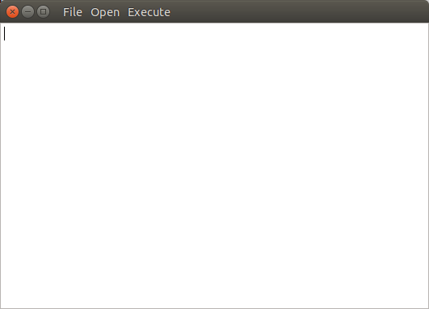

Usage
=====

What KINC program to use?
-------------------------
KINC is meant to be used either on a stand-alone workstation or on a heterogenous cluster of computers.  The graphical program, ``qkinc`` and the command-line tool ``kinc`` are meant to be used in different circumstances. The following table indicates when one should be used over the other.

+-------------------------------------------+-----------------------+---------------------+
| Task                                      | Program               | Resource            |
+===========================================+=======================+=====================+
| Viewing binary files created              | ``qkinc``             | Stand-alone machine |
| by KINC (emx, cmx, ccm or csm files)      |                       |                     |
+-------------------------------------------+-----------------------+---------------------+
| Importing GEM                             | ``qkinc`` or ``kinc`` | Stand-alone or HPC  |
+-------------------------------------------+-----------------------+---------------------+
| Traditional network construction          | ``qkinc`` or ``kinc`` | Stand-alone or HPC  |
+-------------------------------------------+-----------------------+---------------------+
| GMM-based network construction for a      | ``qkinc`` or ``kinc`` | Stand-alone or HPC. |
| small GEM (<60 samples, <20K genes)       |                       | GPU recommended     |
+-------------------------------------------+-----------------------+---------------------+
| GMM-based network construction for a      | ``kinc``              | HPC only.           |
| large GEM                                 |                       | GPU required.       |
+-------------------------------------------+-----------------------+---------------------+
| RMT, Power-law or Condition p-value       | ``qkinc`` or ``kinc`` | Stand-alone or HPC  |
| Thresholding                              |                       |                     |
+-------------------------------------------+-----------------------+---------------------+
| Network extraction                        | ``qkinc`` or ``kinc`` | Stand-alone or HPC  |
+-------------------------------------------+-----------------------+---------------------+

Command-Line Usage
------------------

Getting Started
```````````````
Using the ``kinc`` program will invoke the command-line interface.  Running ``kinc`` without any options will automatically provide default usage instructions for retrieving help:

.. code::

    Help: kinc help <command>

    Get help about the specific command <command>.

    Valid commands:

         run: Run an analytic in normal mode. MPI is automatically detected. If no
              MPI is detected then the analytic will run in single mode.

    chunkrun: Run an analytic in chunk run mode. This mode will execute the
              analytic on a subset of the data and save its results in a temporary
              file.

       merge: Merge all temporary result files from chunkruns into the finished
              output data objects of the analytic run.

        dump: Dump the system or user metadata of a data object to standard output
              as JSON formatted text.

      inject: Inject new user metadata into a data object from a JSON formatted text
              file, overwriting any user metadata the data object currently
              contains.

    settings: Access the global persistent settings for this program to either view
              those settings or change them.

You can retrieve a list of all of the functions that KINC provides by executing

.. code:: bash

  kinc help run

The following will be shown for KINC v3.4:

.. code::

  Command: kinc run <analytic> <options...>
  Runs the given analytic with the given options.

  Help: kinc help run <analytic>
  Get help about running a specific analytic <analytic>.

  Valid analytics:
  import-emx: Import Expression Matrix
  export-emx: Export Expression Matrix
  import-cmx: Import Correlation Matrix
  export-cmx: Export Correlation Matrix
  cond-test: Conditional Test
  similarity: Similarity
  corrpower: Filter: Correlation Power
  powerlaw: Threshold: Power-law
  rmt: Threshold: RMT
  extract: Extract Network


The functions (or analytics) that KINC provides are listed in the ``Valid analytics`` section.  Thus, to import an expression matrix, the function is named ``import-emx``.

The instructions also indicate how to get help for each function by calling ``kinc help run <analytic>`` where ``<analytic>`` is the name of the function. For example, to retrieve help for the ``import-emx`` function:

.. code:: bash

  kinc help run import-emx

which returns:

.. code::

  Command: kinc run|chunkrun|merge import-emx <options...>
  Run the given analytic in normal, chunk, or merge mode. For chunk and merge
  modes all separate executions MUST have the same options provided to the
  analytic.

  OPTIONS

  --input <value>
  Value Type: Input File
  Input text file containing space/tab delimited gene expression data.

  --output <value>
  Value Type: Output Data Object
  A data file created by KINC containing the gene expression matrix created by the
  Import Expression Matrix analytic.

  --nan <value>
  Value Type: String
  Default Value: NA
  Expected token for expressions that have no value.

  --samples <value>
  Value Type: Integer
  Minimum Value: 0
  Maximum Value: 2147483647
  Default Value: 0
  Number of samples. 0 indicates the text file contains a header of sample names
  to be read to determine size.

The output above shows the command-line arguments, the type of value that is accepted and any default values if you do not specify the argument.

.. note::

  Help instructions are accessible on the command-line for every function of KINC.

Executing a Function
````````````````````
Any function  (i.e. analytic) in KINC can be executed in the following way:

.. code:: bash

  kinc run <function> [<arguments>]

Where ``<function>`` is the name of the function and ``[<arguments>]`` is a set of arguments as described in the help documentation of the function. Using the help instructions as shown in the previous section, we can import a GEM, named say `rice_heat_drought.GEM.txt` that has a header and missing values represented as ``NA`` in the following way:

.. code:: bash

   kinc run import-emx --input ./rice_heat_drought.GEM.txt --output ./rice_heat_drought.GEM.emx --nan "NA"

Using Multiple CPUs
```````````````````
With MPI
::::::::

KINC can use the Message Passing Interface (MPI) to take advantage of multiple CPUs.  This includes CPUs on a stand-alone workstation or across an HPC system.  To use MPI on a stand-alone workstation you must launch KINC using the ``mpiexec`` program and specify the number of processes to use with the ``-np`` argument. For example to launch a function using 4 CPUs:

.. code:: bash

  mpiexec -np 4 kinc run <function> [<arguments>]

To use MPI on an HPC system, please consult with the HPC admins or the system's usage documentation to properly use MPI as each system may have a different setup and different instructions.

With Chunking
:::::::::::::
KINC executes a function by dividing the entire task into sub units that can be processed independently of one another. When using MPI, KINC launches a "master" instance and several "worker" instances. The master communicates with the workers and provides them with work units. However, when MPI is not available, it is possible to manually launch multiple instances of ``kinc`` and instruct each one to work on a different set of work units.  To use chunking you must use the command ``chunkrun`` instead of ``run`` and provide two additional arguments:  ``index`` and ``size``:

.. code:: bash

  kinc chunkrun <index> <size> <function> [<arguments>]

Here the ``<size>`` argument is the total number of chunks to use.  This should be set to the number of ``kinc`` processes you wish to run.  Then, launch each ``kinc`` instance with an ``index`` value from 1 to ``<size>``.  Each instance of KINC will automatically know which set of work units to process.

Once all of the KINC instances have completed their chunks, the results must be merged together into a single file.  This is  accomplished using the ``merge`` command.  You must provide the exact same arguments to the ``merge`` command as was provided to the ``chunkrun`` command, with the exception of the ``<index>`` argument:

.. code:: bash

  kinc merge <size> <function> [<arguments>]

.. note::

  When using the ``chunk`` command you can launch as many KINC processes as your computing resources will allow. Just be sure to set the ``<size>`` argument to match.  However, when running the ``merge`` command you will only launch one instance to merge everything into a single file.

.. note::

  Use of MPI with KINC is much more efficient than the chunking approach. This is because KINC can provide more work units to faster nodes. So, it is best to use MPI when the facility is available.


Global Settings
```````````````
KINC maintains a set of global settings. These are parameters that control the behavior of KINC and are persistent between KINC executions. If a setting change is made by one instance of KINC, it is set for all instances.  You can see the list of settings provided by KINC by executing the following command:

.. code:: bash

  kinc settings

The above command results in the following:

.. code::

  SETTINGS

              CUDA Device: 0
            OpenCL Device: 0:0
  CUDA/OpenCL Thread Size: 4
          MPI Buffer Size: 4
  Chunk Working Directory: .
             Chunk Prefix: chunk
          Chunk Extension: abd
                  Logging: off

The settings and their meaning are described in the following table:

+------------------+--------------------------------------------------------------------+
| Setting          | Description                                                        |
+==================+====================================================================+
| CUDA Device      | The index of the default GPU device for use with the CUDA          |
|                  | drivers. This defaults to index 0 on a machine with a GPU          |
+------------------+--------------------------------------------------------------------+
| OpenCL Device    | The index of the default GPU device for use with the               |
|                  | OpenCL drivers. This defaults to index 0:0 on a machine with a GPU |
+------------------+--------------------------------------------------------------------+
| CUDA/OpenCL      | The number of threads to use for the GPU.                          |
| Thread Size      |                                                                    |
+------------------+--------------------------------------------------------------------+
| MPI Buffer Size  | The size of the MPI buffer when the master and worker nodes        |
|                  | communicate                                                        |
+------------------+--------------------------------------------------------------------+
| Chunk Working    | The directory where the chunk results files will go                |
| Directory        |                                                                    |
+------------------+--------------------------------------------------------------------+
| Chunk Prefix     | The prefix that will be used for all of the chunk files.           |
+------------------+--------------------------------------------------------------------+
| Chunk Extension  | The extension that will be used for all of the chunk files.        |
+------------------+--------------------------------------------------------------------+
| Logging          | For debugging purposes, KINC will provide very deep logging. Users |
|                  | need not ever enable loggingas this is meant for KINC developers.  |
+------------------+--------------------------------------------------------------------+

**TODO: add example for settings change**

.. note::

  Most users will never need to adjust these persistent settings.

Graphical Interface Usage
-------------------------
KINC provides a graphical user interface (GUI) for viewing binary output files and for executing less computationally intensie jobs.  The graphical interfaceis meant to run only on a stand-alone workstation as it cannot launch multiple worker instances as the command-line version can do.  This section provides a brief over of the GUI.   To launch ``qkinc`` simply call it on the command-line:

.. code:: bash

  qkinc

When the GUI first appears, it is a simple dialog box with a menu:



The following items are available in the main menu:

File: for general settings and information.
  - `Settings`
  - `About`
  - `Exit`

Open: for opening KINC binary files
  - `Expression Matrix`
  - `Cluster Matrix`
  - `Correlation Matrix`
  - `Condition-Specific Clusters Matrix`

Execute: for running the functions of KINC
  - `Import Expression Matrix`
  - `Export Expression Matrix`
  - `Import Correlation Matrix`
  - `Export Correlation Matrix`
  - `Similarity`
  - `Filter: Correlation Power`
  - `Threshold: Conditional Test`
  - `Threshold: Power-law`
  - `Threshold: RMT`
  - `Extract Network`
